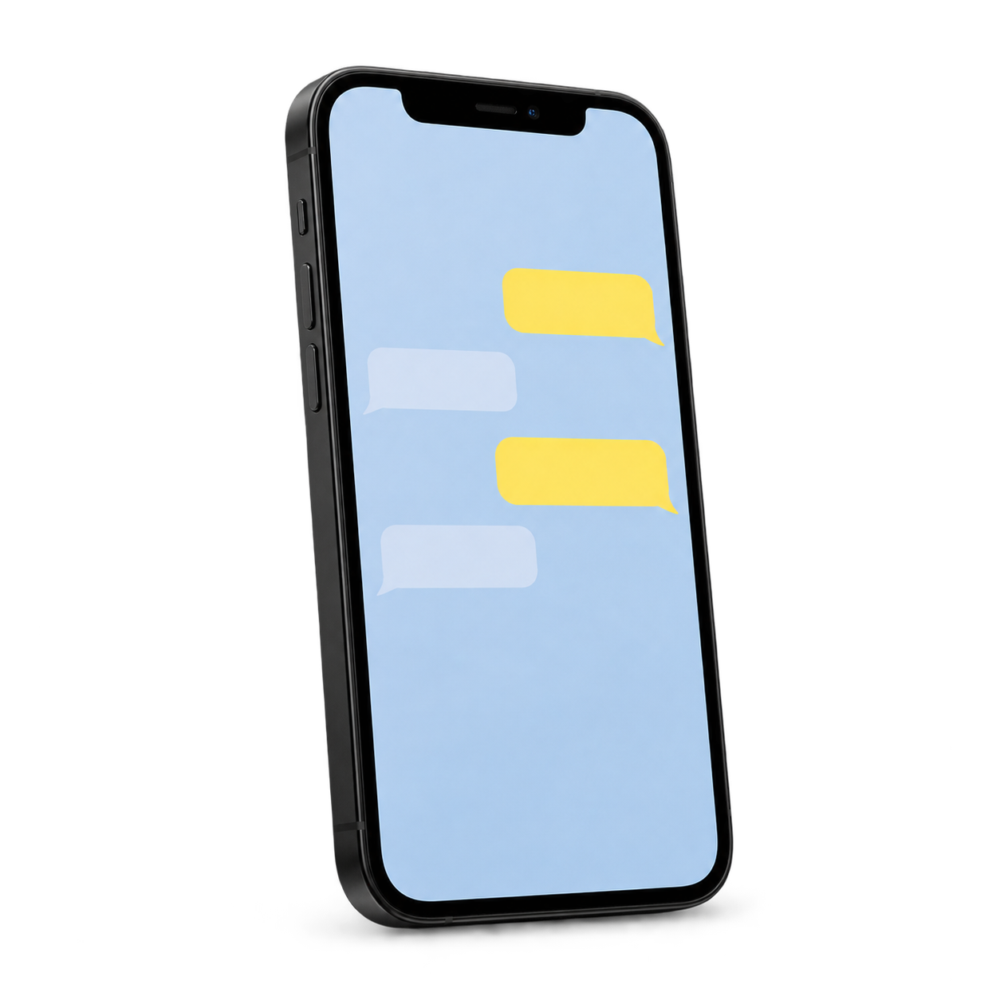
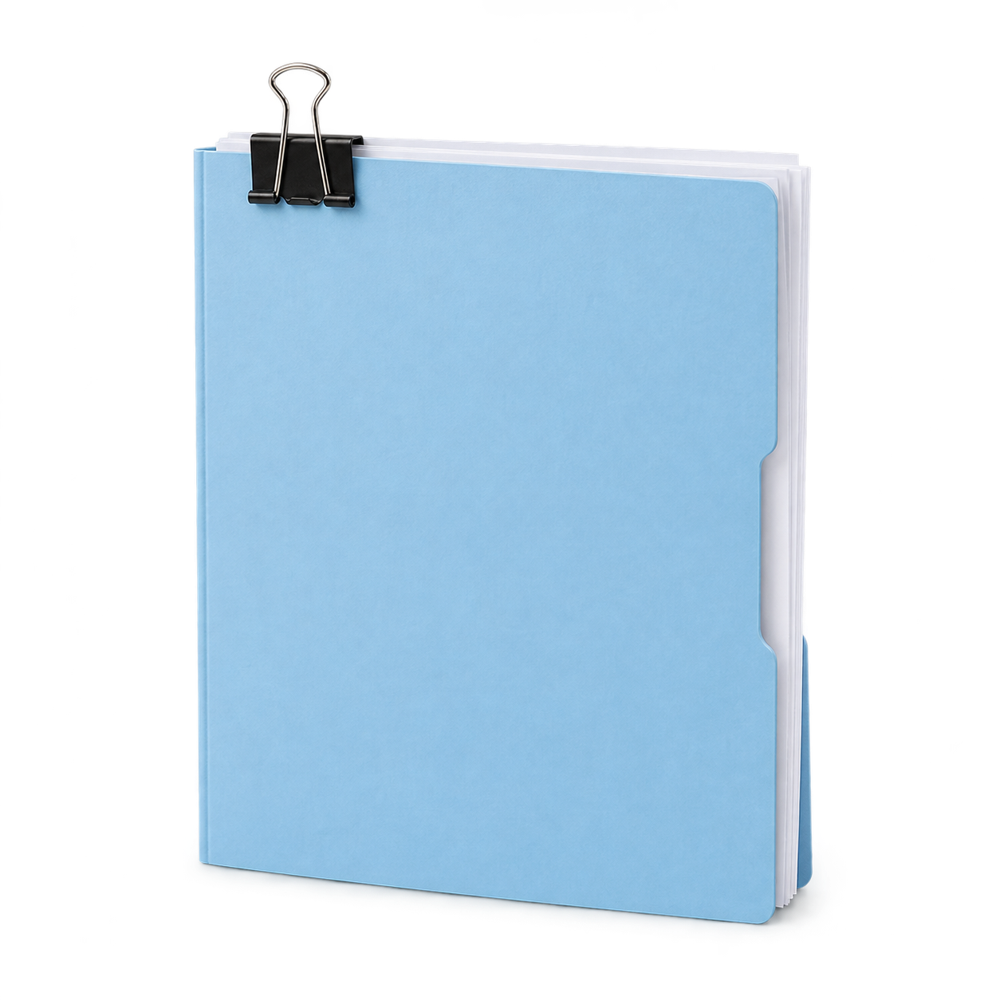
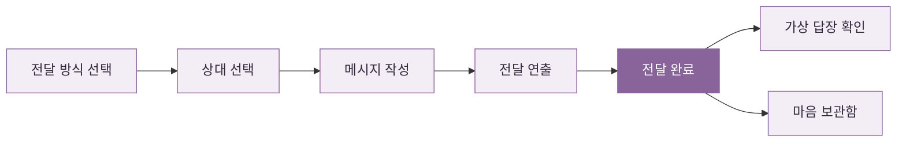

<div align="center">


# 전하지 못한 진심

**현실에서 못 했던 말, 여기서 한 번 보내보세요.**

메신저 · 이메일 · 공문 · 보고서로 작성하고,<br />
전달 연출과 상대의 가상 답장을 확인하는 인터랙티브 웹 서비스.

[](https://unsent-notes-six.vercel.app/)


</div>

---

## 이런 서비스예요

“부장님만 집 있나요. 저도 퇴근하고 싶어요.”

말하고 싶었지만 보내지 못한 문장을 익숙한 앱 화면에 적어보는 서비스예요. 전달 방식을 고르고, 상대를 정하고, 작성하면 끝. 실제 상대에게 전송하지 않고 선택한 방식에 맞는 애니메이션이 이어져요.

| 기능 | 할 수 있는 일 |
| :--- | :--- |
| ✉️ 전달 방식 | 사내 메신저, 이메일, 공문, 보고서 중 하나를 골라요 |
| 👥 상대 선택 | 상사 · 교수님 · 😈 팀플 빌런 팀원 · 클라이언트 · 전 연인 · 친구 |
| ✍️ 메시지 작성 | 상대와 상황에 맞는 화면에서 최대 2,000자까지 작성해요 |
| 📬 전달 연출 | 읽음 표시, 메일 처리, 공문 접수, 보고서 결재를 경험해요 |
| 💬 가상 답장 | 상대의 말투로 사과하거나 수긍하는 답장을 확인해요 |
| 🗂️ 마음 보관함 | 최근 100개의 메시지와 답장을 이 브라우저에 보관해요 |

## 네 가지 전달 방식

<table>
  <tr>
    <th width="25%">사내 메신저</th>
    <th width="25%">이메일</th>
    <th width="25%">공문</th>
    <th width="25%">보고서</th>
  </tr>
  <tr>
    <td align="center"></td>
    <td align="center"></td>
    <td align="center"></td>
    <td align="center"></td>
  </tr>
  <tr>
    <td align="center">채팅방과 말풍선<br />읽음 표시까지</td>
    <td align="center">받는 사람과 제목<br />메일 작성 화면</td>
    <td align="center">수신·제목·본문<br />직인과 접수 연출</td>
    <td align="center">문서 편집 도구<br />결재선과 보고서</td>
  </tr>
</table>

위 이미지는 서비스에서 사용하는 테마 이미지예요. 실제 화면은 **[여기에서 직접 확인할 수 있어요 →](https://unsent-notes-six.vercel.app/)**

## 한 문장이 전달되기까지



한 단계에 하나의 화면만 보여줘요. 모바일에서는 전달 방식 카드를 한 열로 배치하고, 데스크톱에서는 넓은 화면을 활용해 나란히 보여줘요.

## 기술 스택

| 항목 | 사용 기술 |
| :--- | :--- |
| UI | React 19 · TypeScript |
| 프레임워크 | vinext — Next.js App Router 방식의 Vite 기반 구현 |
| 스타일 | Tailwind CSS 4 · CSS · Pretendard |
| UI 구성 요소 | Base UI · Lucide React |
| 상태 관리 | React `useState` · `useEffect` · `useRef` |
| 기록 저장 | 브라우저 `localStorage` |
| Vercel 빌드 | Vite · Nitro (`vercel` preset) |
| 배포 | Vercel |

### 답장과 기록

답장은 외부 AI가 생성하는 방식이 아니라, 상대별로 준비한 문구를 사용해요. 메시지는 React의 텍스트 렌더링으로 표시하고, 메시지 내용 전송을 위한 외부 API는 호출하지 않아요.

기록은 계정이 아닌 **현재 브라우저**에 저장돼요. 다른 기기와 동기화되지 않고, 브라우저 데이터를 지우면 함께 사라져요. 저장 공간을 사용할 수 없으면 화면에 안내가 표시돼요.

## 시작하기

Node.js 22.13.0 이상과 npm이 필요해요.

```bash
git clone https://github.com/garamiiee/unsent-notes.git
cd unsent-notes
npm install
npm run dev
```

터미널에 표시되는 로컬 주소로 접속하세요. Windows PowerShell에서 스크립트 실행 오류가 나면 `npm` 대신 `npm.cmd`를 사용하세요.

## 개발 명령어

| 명령어 | 설명 |
| :--- | :--- |
| `npm run dev` | 로컬 개발 서버 |
| `npm run build` | 기본 vinext 빌드 |
| `npx tsc --noEmit` | TypeScript 타입 검사 |
| `npm run lint` | Oxlint 코드 검사 |
| `npm run format` | Oxfmt 코드 포맷 |

Vercel은 `vercel.json`에 설정된 `NITRO_PRESET=vercel npx vite build` 명령을 사용해요. 기본 로컬 빌드와 배포용 빌드 경로가 달라요.

## 프로젝트 구조

```text
app/
  page.tsx          # 단계별 화면 · 전달 연출 · 가상 답장 · 보관함
  globals.css       # 공통 스타일 · 테마별 작성 화면 · 반응형 규칙
  layout.tsx        # HTML 언어 · 페이지 메타데이터
components/ui/      # 공용 UI 구성 요소
public/
  images/           # 전달 방식 이미지
  fonts/            # Pretendard 폰트와 라이선스
vite.config.ts      # Vite · vinext · 배포 환경별 플러그인
vercel.json         # Vercel 빌드 설정
```

---

<div align="center">

**전하지 못한 진심** · Made by [Garam Kim](https://github.com/garamiiee)

[서비스 열기](https://unsent-notes-six.vercel.app/) · [소스 코드](https://github.com/garamiiee/unsent-notes)

</div>
